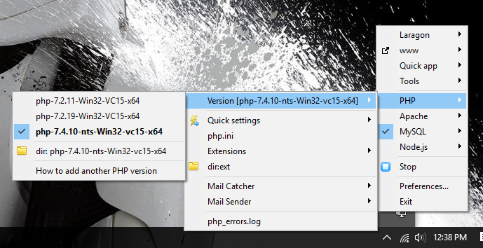

The Laravel team recently announced a new scaffolding application for Laravel 8 called Laravel Jetstream.
It scaffolds a working Laravel app with login, registration, email verification, two-factor authentication, session management, and even optional team management.

I installed Jetstream using the Laragon setup. However, it fails to create a Laravel app due to the PHP version mismatch pre-installed on Laragon by default. For Laravel Jetstream to work, PHP 7.4 or higher must be installed on the developer machine.

The quick solution to this is, of course, to add a specific version of PHP on Laragon.

So how do you add a new version of PHP in Laragon? It is easy and straight to the point.

## Steps to follow

1. Download PHP version 7.4 zip file on PHP download [page](https://windows.php.net/download).

2. Extract the zip file and put inside the root laragon installation folder > bin > PHP. I'm using Windows OS, in my case, it is in:

```
C:>laragon>bin>php
```

3. Run Laragon and change the version of the PHP to 7.14. See the image below for reference.
   

That was it! I was able to successfully scaffold a new Laravel app with Laravel Jetstream without bumping into errors.

## Happy Coding!
