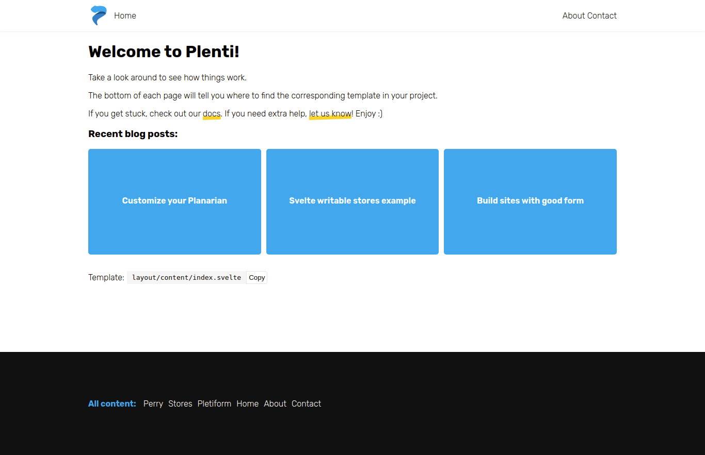

I was browsing on Github and came across this static site generator called Plenti. It's a new static site generator based on Svelte and Go.
I gave it a try, and I was amazed at how fast it is.
Let me introduce you to Plenti and how you can create and host sites made with Plenti on Netlify.

## Brief Intro to Plenti

Plenti is yet again another static site generator. But it is way faster compared to some popular Javascript-based static site generators. It uses Svelte on the frontend, which means your site is faster and leaner than some sites built with other Javascript framework SSG. Plenti uses Go, a popular programming language by Google, on its command line interface (CLI) to cut up and reduce processes such as traditional bundlers like webpack or rollup.

Plenti uses Git-backed CMS similar to what Gridsome and Nuxt content offered. But it uses a simple JSON data source instead of a typical markdown.

I won't explain much Plenti. You may want to read its official [documentation](https://plenti.co/docs).

## Important

Before proceeding to the tutorial, I assume you have at least a basic knowledge of Git. I also assume that you know Netlify already.

## Prerequisites

1. VSCode
2. Github account
3. Netlify account

Before we proceed to the tutorial, let's install Plenti first on our machine.
If you're on Windows, you can use Scoop.

```javascript
1. scoop bucket add plenti https://github.com/plentico/scoop-plenti
2. Install: scoop install plenti.
```

If you're on Linux, you can use snap.

```javascript
snap install plenti
```

Once, we installed Plenti on our system, we can now create a default Plenti site.

# 1. Create a plenti site

Open terminal and cd to your preferred project location directory, type the following:

```javascript
plenti new site <project-name>
```

project-name can be any name you want.
This will scaffold a new Plenti project.

# 2. Run your site

Open your newly Plenti site project on VSCode. Open the integrated terminal and run the following command.

```
plenti serve
```

This will compile your project. Head over to localhost:3000.

You'll see something like this if everything works well.



# 3. Build your site

To build your site, run the following command on the terminal.

```javascript
plenti build
```

This will build your Plenti site inside the public directory. This creates static assets and generates Svelte code that we can deploy to Netlify.

# 3. Push your project on Github

### IMPORTANT!

Before you push your code on Github, open .gitignore on VSCode first and remove the public line. We need to include the public folder in our repository. We need to tell git to commit the public directory that contains our compiled website.

Create a new repo on Github and push your code. I named my repository plenti-test for a demonstration purpose.


# 4. Publish on Netlify

Open your Netlify dashboard and create a new website.

Connect to your Git provider which in our case, Github. Then select your project.

Next on deploy setting, set the branch to master and the publish directory to public.


Hit that deploy site button and immediately see your site build instantly.

And it's that easy! Your Plenti site is now hosted on Netlify.

## Note

If you make a changes to your code, you need to rebuild your project before pushing again to Github to make sure changes will reflect on your hosted site.

## Summary

In this tutorial, you learned what is Plenti static site generator. You learned how to create, serve, compile and build a new plenti site, and how to deploy on Netlify.

That's all for now. If you have questions, feel free to contact me on my socials.

## Happy Coding!
